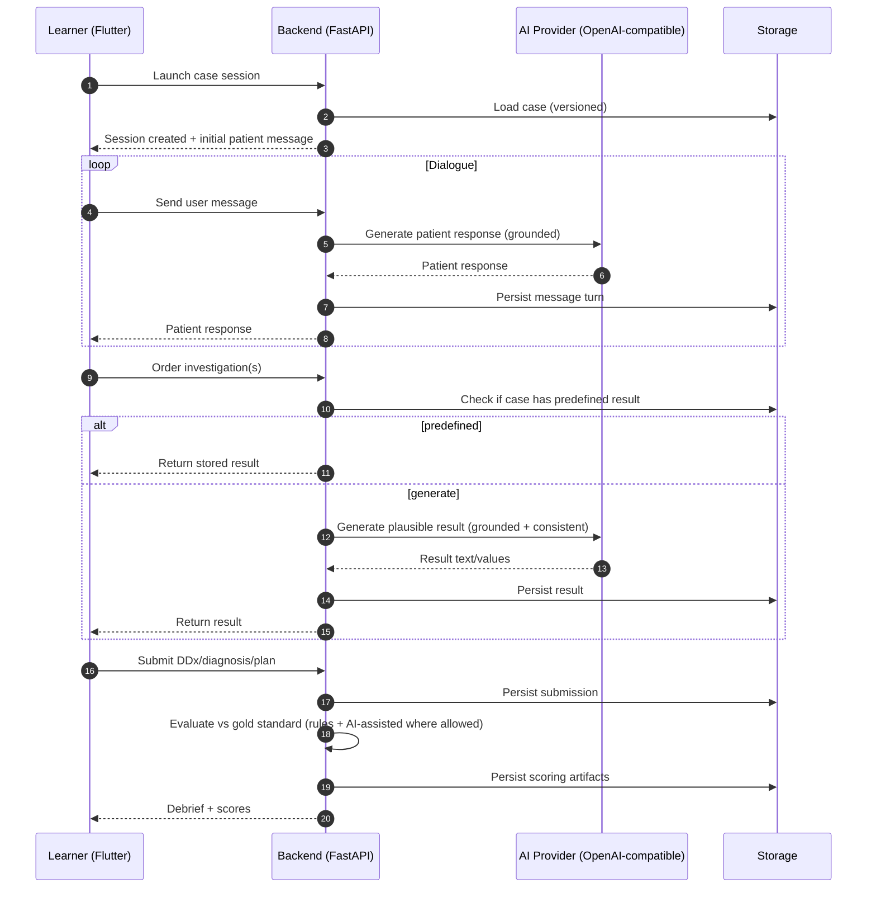

# System Architecture

## Architectural challenges and goals

- **Portability across clients**
  - The Virtual AI Patient must be accessible from multiple clients: web, Telegram bot, and potentially mobile or other channels.
  - The architecture therefore centralizes logic in the backend and exposes channel-agnostic APIs, so new clients can be added without changing the core domain logic.

- **LLM-agnostic AI Patient**
  - The AI Patient is based on an LLM, but the concrete provider can vary.
  - The LLM interface in the dependencies layer abstracts provider-specific details (API shape, auth, rate limits), enabling swapping between different LLMs with minimal impact on the backend.

- **Per-client AI Patients**
  - Different clients (e.g. different clinics, teams, or deployments) should be able to have their *own* Virtual AI Patients (separate configuration, prompts, and possibly models).
  - This requires multi-tenancy support in the backend and persistence layer (e.g. tenant-aware storage for patient configurations, conversations, and audit data).

- **Maintainability and testability**
  - Clear separation between clients, backend, and the dependency layer allows the business logic to be tested independently of infrastructure.
  - Mock implementations for both the database and LLM are first-class parts of the design, so automated tests can run deterministically without relying on external services or real data stores.

## High-level architecture

```mermaid
flowchart TB
    subgraph Clients
        TG[Telegram bot<br/>(primary client)]
        WEB[Web frontend<br/>(secondary client)]
    end

    TG --> NGINX[nginx]
    WEB --> NGINX
    NGINX --> BE[Backend]

    subgraph Dependencies layer
        subgraph DBLayer[Database interaction interface]
            MOCKDB[Mock database]
            PG[(PostgreSQL<br/>(internal dependency))]
        end

        subgraph LLMLayer[LLM interface<br/>(external dependency)]
            LLM[LLM]
            MOCKLLM[Mock LLM]
        end
    end

    BE --> DBLayer
    BE --> LLMLayer

    DBLayer --> MOCKDB
    DBLayer --> PG
    LLMLayer --> LLM
    LLMLayer --> MOCKLLM
```

## Dependencies layer

- **Database interaction interface**
  - **Responsibility**: Provides an abstraction for all data-access operations so the backend does not depend on a concrete database implementation.
  - **Production dependency**: **PostgreSQL (internal dependency)** – primary data store for persistent application data.
  - **Testing/development dependency**: **Mock database** – in-memory or lightweight storage used for tests and local runs without a real Postgres instance.

- **LLM interface (external dependency)**
  - **Responsibility**: Wraps all interactions with the external LLM provider behind a stable internal API.
  - **Production dependency**: **LLM** – external large language model service used in the main deployment.
  - **Testing/development dependency**: **Mock LLM** – deterministic or simplified implementation used for tests and offline development.

## Components
- **Flutter Client**
  - Chat UI
  - Investigations ordering UI
  - Submission forms (DDx/diagnosis/plan)
  - Debriefing view

- **FastAPI Backend**
  - Auth / SSO integration
  - Case catalog and access control
  - Session state machine
  - AI orchestration (patient dialogue + investigation generation)
  - Evaluation and scoring
  - Analytics export

- **AI Provider (OpenAI-compatible)**
  - OpenAI-style REST API
  - Token-based authentication
  - Model routing configurable per environment

- **Storage**
  - Case content store (versioned cases)
  - Session store (messages, orders, submissions)
  - Evaluation artifacts (scores, evidence)

## Data flow (typical session)


## Architectural principles
- **Case-grounded generation**: the AI layer must not invent facts that contradict the case truth.
- **Reproducible scoring**: cases are versioned; scoring references a specific case version.
- **Provider-agnostic AI adapter**: only one integration layer speaks OpenAI-compatible API.
- **Auditable evaluation**: every score deduction has evidence and rationale for debriefing.
- **Security by design**: no real patient data; strict separation of case content vs user data.

