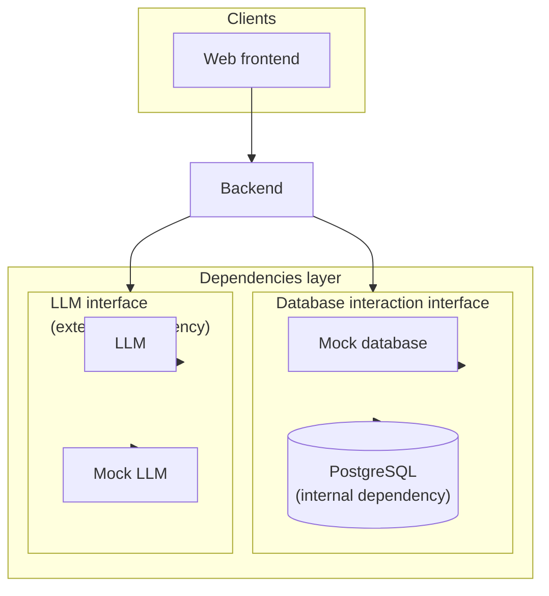
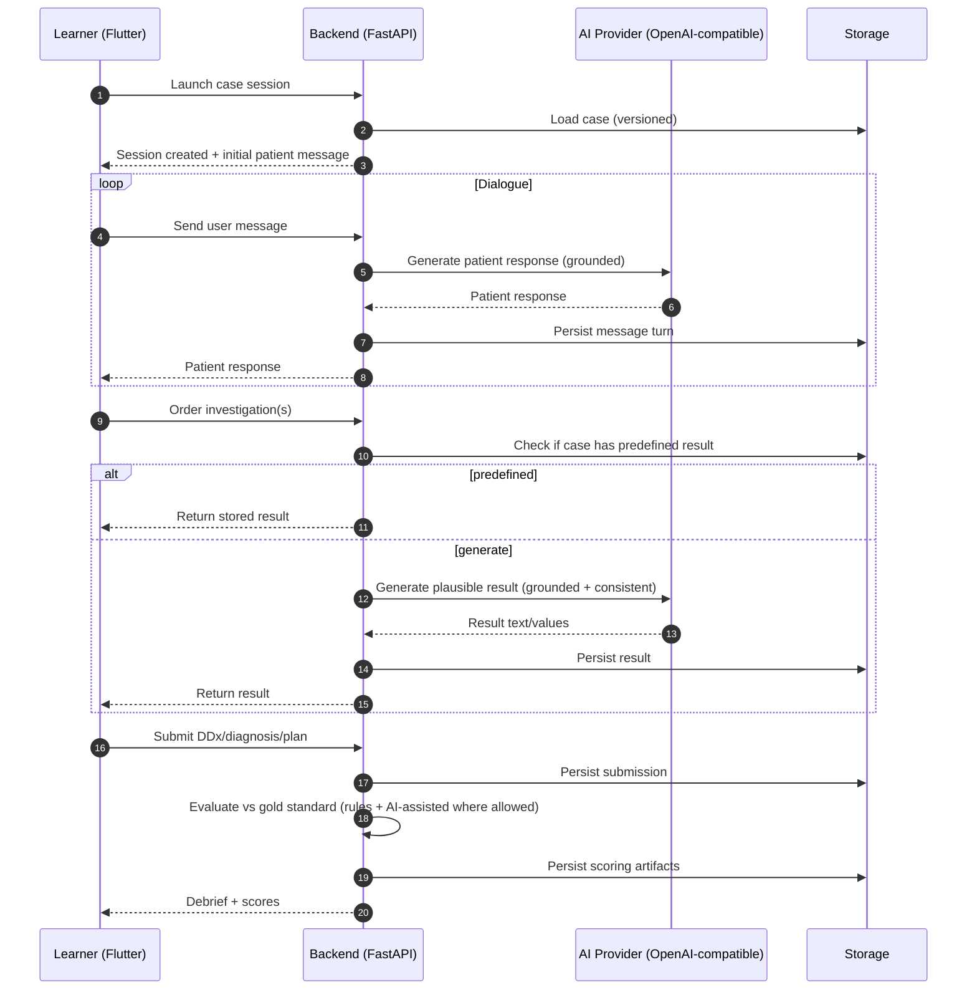
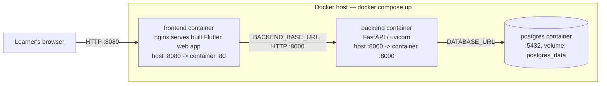

# System Architecture

## Diagram legend

This document uses three diagram families, each answering a different question:

- **Container diagram** (C4 model, Level 2) — "what are the running pieces and how do they talk to each other?" It shows components (clients, backend, external services) and the connections between them, but not runtime sequencing or physical deployment. Diagram 1 below.
- **Sequence diagram** (UML) — "in what order do messages happen for one scenario?" It shows a single flow through time, across participants, for one representative session. Diagram 2 below. It is not a state machine and does not capture every possible branch.
- **Deployment diagram** (UML) — "what physically runs where, and on what ports?" It shows processes/containers, host boundaries, and network exposure — not application logic. Diagram 3 below.

## Architectural challenges and goals

- **Portability across clients**
  - The Virtual AI Patient must be accessible from multiple clients: web and potentially mobile or other channels.
  - The architecture therefore centralizes logic in the backend and exposes channel-agnostic APIs, so new clients can be added without changing the core domain logic.

- **LLM-agnostic AI Patient**
  - The AI Patient is based on an LLM, but the concrete provider can vary.
  - The LLM interface in the dependencies layer abstracts provider-specific details (API shape, auth, rate limits), enabling swapping between different LLMs with minimal impact on the backend.

- **Per-client AI Patients**
  - Different clients (e.g. different clinics, teams, or deployments) should be able to have their *own* Virtual AI Patients (separate configuration, prompts, and possibly models).
  - This requires multi-tenancy support in the backend and persistence layer (e.g. tenant-aware storage for patient configurations, conversations, and audit data).

- **Maintainability and testability**
  - Clear separation between frontend, backend, and the dependency layer allows the business logic to be tested independently of infrastructure.
  - Mock implementations for both the database and LLM are first-class parts of the design, so automated tests can run deterministically without relying on external services or real data stores.

## Diagram 1 — High-level architecture

**Notation:** C4 model, Level 2 (Container diagram), rendered with mermaid `flowchart TB`.

```mermaid
flowchart TB
    subgraph Clients
        WEB["Web frontend"]
    end

    WEB --> BE[Backend]

    subgraph Dependencies layer
        subgraph DBLayer[Database interaction interface]
            MOCKDB[Mock database]
            PG[("PostgreSQL\n(internal dependency)")]
        end

        subgraph LLMLayer["LLM interface\n(external dependency)"]
            LLM[LLM]
            MOCKLLM[Mock LLM]
        end
    end

    BE --> DBLayer
    BE --> LLMLayer

    DBLayer --> MOCKDB
    DBLayer --> PG
    LLMLayer --> LLM
    LLMLayer --> MOCKLLM
```

## Dependencies layer

- **Database interaction interface**
  - **Responsibility**: Provides an abstraction for all data-access operations so the backend does not depend on a concrete database implementation.
  - **Production dependency**: **PostgreSQL (internal dependency)** – primary data store for persistent application data.
  - **Testing/development dependency**: **Mock database** – in-memory or lightweight storage used for tests and local runs without a real Postgres instance.

- **LLM interface (external dependency)**
  - **Responsibility**: Wraps all interactions with the external LLM provider behind a stable internal API.
  - **Production dependency**: **LLM** – external large language model service used in the main deployment.
  - **Testing/development dependency**: **Mock LLM** – deterministic or simplified implementation used for tests and offline development.

## Components
- **Flutter Client**
  - Chat UI
  - Investigations ordering UI
  - Submission forms (DDx/diagnosis/plan)
  - Debriefing view

- **FastAPI Backend**
  - Auth / SSO integration
  - Case catalog and access control
  - Session state machine
  - AI orchestration (patient dialogue + investigation generation)
  - Evaluation and scoring
  - Analytics export

- **AI Provider (OpenAI-compatible)**
  - OpenAI-style REST API
  - Token-based authentication
  - Model routing configurable per environment

- **Storage**
  - Case content store (versioned cases)
  - Session store (messages, orders, submissions)
  - Evaluation artifacts (scores, evidence)

## Diagram 2 — Data flow (typical session)

**Notation:** UML sequence diagram, rendered with mermaid `sequenceDiagram`.

```mermaid
sequenceDiagram
  autonumber
  participant U as Learner (Flutter)
  participant B as Backend (FastAPI)
  participant A as AI Provider (OpenAI-compatible)
  participant S as Storage

  U->>B: Launch case session
  B->>S: Load case (versioned)
  B-->>U: Session created + initial patient message

  loop Dialogue
    U->>B: Send user message
    B->>A: Generate patient response (grounded)
    A-->>B: Patient response
    B->>S: Persist message turn
    B-->>U: Patient response
  end

  U->>B: Order investigation(s)
  B->>S: Check if case has predefined result
  alt predefined
    B-->>U: Return stored result
  else generate
    B->>A: Generate plausible result (grounded + consistent)
    A-->>B: Result text/values
    B->>S: Persist result
    B-->>U: Return result
  end

  U->>B: Submit DDx/diagnosis/plan
  B->>S: Persist submission
  B->>B: Evaluate vs gold standard (rules + AI-assisted where allowed)
  B->>S: Persist scoring artifacts
  B-->>U: Debrief + scores
```

## Diagram 3 — Deployment view

**Notation:** UML deployment diagram, rendered with mermaid `flowchart LR`.

Reflects the current `docker-compose.yml`: a single Docker host runs three containers. There is no reverse proxy in front of them — the frontend and backend are each exposed directly on their own host port, and the browser talks to both.

```mermaid
flowchart LR
    Browser["Learner's browser"]

    subgraph Host["Docker host — docker compose up"]
        FE["frontend container\nnginx serves built Flutter web app\nhost :8080 -> container :80"]
        BE["backend container\nFastAPI / uvicorn\nhost :8000 -> container :8000"]
        PG[("postgres container\n:5432, volume: postgres_data")]
    end

    Browser -->|HTTP :8080| FE
    FE -->|BACKEND_BASE_URL, HTTP :8000| BE
    BE -->|DATABASE_URL| PG
```

The nginx inside the frontend container is a **static-file server for the built web app** — a Dockerfile implementation detail, not the reverse proxy that used to sit in front of the client in Diagram 1. That reverse-proxy nginx never had checked-in config in this repo; it was diagram-only and has been removed rather than relocated.

## LLM Patient Role Design

The believability of the LLM patient role is the product's primary differentiator: comparable clinical-training platforms exist, so quality of execution of the patient behaviours is what the proposal competes on. This section describes how the four core behaviours are realised at the prompt/orchestration level. Full evidence — what was tested, what worked, and what remains preliminary — lives in [Patient role research](../proposal/patient-role-research.md).

- **Lying (concealment vs partial recall)**
  - Two prompt patterns: **deliberate concealment** (an explicit prohibition on naming the diagnosis or using clinical vocabulary, paired with a persona-consistent deflection style) and **partial recall** (the patient reveals a sensitive fact only under repeated direct questioning).
  - Concealment is validated in multi-model runs; partial recall is a design candidate not yet tested. Example pattern and results: [Lying findings](../proposal/patient-role-research.md#lying).

    > Не называй медицинский диагноз и не используй медицинские термины (сердечный приступ, перикардит и т.п.). Если врач предлагает диагноз — отвечай как растерянный пациент, не как специалист.

- **Forgetting**
  - Baseline: a **closed-world instruction with an explicit negative inventory** — the patient answers "не знаю / не помню / не замечал" for anything outside the authorised fact set instead of confabulating. Validated at temperature 0.3; see [Forgetting findings](../proposal/patient-role-research.md#forgetting).
  - Design direction: **turn-count triggered state degradation** — as the interview grows longer, the orchestrator marks selected low-salience facts as "faded" in the per-turn state so the patient plausibly forgets details. Not yet validated (preliminary).

- **Emotions**
  - **Tone modulation grounded in the case persona**: the case defines the emotional state ("тревожный — напуган, но старается чётко отвечать"), and the system prompt binds tone to that persona together with a reply-length constraint so emotion does not become monologue. See [Emotional states findings](../proposal/patient-role-research.md#emotional-states).

- **State management**
  - Per-turn state (facts already disclosed, current disclosure level, emotional state, faded facts) is maintained by the backend session state machine and **fed back into the prompt on every turn**: the system block carries the case facts and behaviour rules, while the full dialogue history is passed in `messages` (no truncation at tested lengths of ~25 turns; truncation and summary policies remain untested).
  - This is what keeps repeated questions consistent with earlier answers (G4 class in the [failure catalogue](../research/ai-patient-problems-and-mitigations.md)); temperature is held near 0.3 in production since higher values introduced consistency failures.

## QA compliance

Which QA-rev3 attribute each architectural decision satisfies (see [qa-rev3.md](../qa/qa-rev3.md)):

| Architectural decision | QA-rev3 attribute |
| :--- | :--- |
| LLM interface abstraction (dependencies layer) | [QA-ARCH-01](../qa/qa-rev3.md#5-architecture--observability-qa-arch) — pluggable AI adapter, no changes outside the adapter layer to swap providers |
| Session state machine persists every message/order/submission to Storage | [QA-ARCH-02](../qa/qa-rev3.md#5-architecture--observability-qa-arch) — structured logging of all learner actions |
| `docker compose up` brings up frontend, backend, and postgres with no manual steps (Diagram 3) | [QA-REPRO-01](../qa/qa-rev3.md#6-reproducibility-qa-repro) — one-command full-stack startup |
| Mock LLM in the dependencies layer | [QA-REPRO-03](../qa/qa-rev3.md#6-reproducibility-qa-repro) — prototype runs without an external API key |
| Mock database in the dependencies layer | [QA-REPRO-01](../qa/qa-rev3.md#6-reproducibility-qa-repro) — deterministic local runs without a real Postgres instance |
| Case-grounded generation + versioned cases | [QA-SAFE-02](../qa/qa-rev3.md#4-ai-safety--guardrails-qa-safe) — output grounded in case data, not invented facts |
| Per-turn state fed back into the prompt every turn (see [LLM Patient Role Design](#llm-patient-role-design)) | [QA-PERF-01](../qa/qa-rev3.md#2-performance--latency-qa-perf) — chat responses within the immersion-preserving latency budget |

## Architectural principles
- **LLM Patient Role Design is the primary differentiator** — see [§ LLM Patient Role Design](#llm-patient-role-design); patient-behaviour quality claims must trace to [Patient role research](../proposal/patient-role-research.md).
- **Case-grounded generation**: the AI layer must not invent facts that contradict the case truth.
- **Reproducible scoring**: cases are versioned; scoring references a specific case version.
- **Provider-agnostic AI adapter**: only one integration layer speaks OpenAI-compatible API.
- **Auditable evaluation**: every score deduction has evidence and rationale for debriefing.
- **Security by design**: no real patient data; strict separation of case content vs user data.
