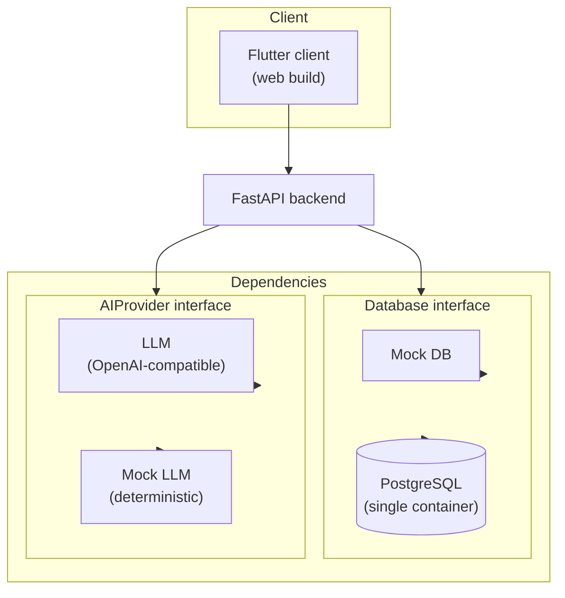
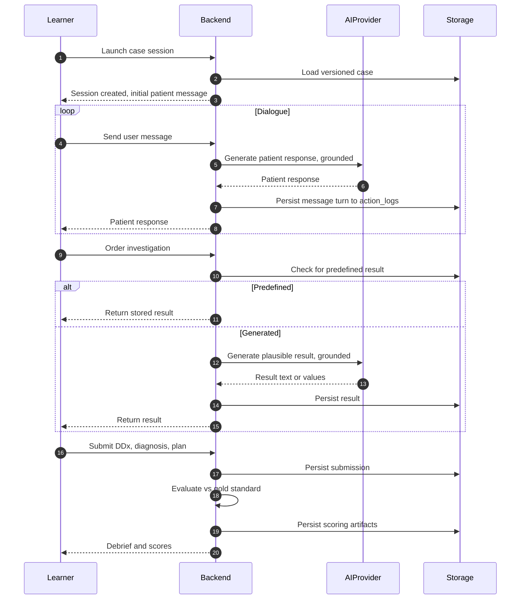
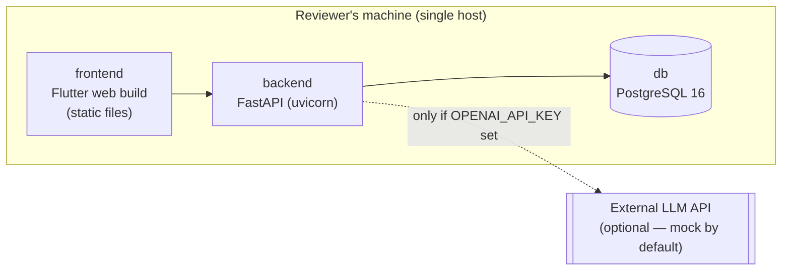

# System Architecture

**Scope note.** This document describes the architecture of the Virtual AI
Patient **prototype**. The project's target is a documented, reproducible
prototype delivered to Innopolis University (IU). It is not designed for
clinical deployment, multi-tenant hosting, or high-availability operation —
those decisions are explicitly left open for whoever picks the codebase up
next (see [What IU receives](#what-iu-receives) at the bottom).

## Architectural goals

- **LLM-agnostic AI Patient.** The AI Patient is driven by an LLM, but the concrete provider is behind a single `AIProvider` interface. The prototype ships with an OpenAI-compatible adapter and a deterministic **Mock LLM** so the demo runs end-to-end without a paid API key.
- **Reproducibility for a cold reader.** A fresh clone plus `docker compose up` must reach a working demo. There are no manual infrastructure steps, no cluster, no external services required beyond an LLM API key (and even that is optional via the mock).
- **Maintainability and testability.** Backend, client, and dependencies (DB, LLM) are separated so business logic can be tested against mocks. The AI provider and database interfaces both have first-class mock implementations.
- **Traceable demo runs.** Every learner action lands in an `action_logs` table so any reviewer can replay a session — this is what makes the evaluation and debrief reproducible.

Out of scope, deliberately: multi-tenancy, per-tenant model configuration, horizontal scaling, HA / failover, TLS termination inside the stack, SSO, and clinical-grade audit compliance.

## Diagram 1 — Static component view

Shows the pieces that make up the prototype and how they connect. This is a **structural diagram**: it says nothing about time or sequence — only which component talks to which.

```mermaid
flowchart TB
    subgraph Client
        WEB["Flutter client<br/>(web build)"]
    end

    WEB --> BE[FastAPI backend]

    subgraph Dependencies
        subgraph DBLayer["Database interface"]
            MOCKDB[Mock DB]
            PG[("PostgreSQL<br/>(single container)")]
        end

        subgraph LLMLayer["AIProvider interface"]
            LLM["LLM<br/>(OpenAI-compatible)"]
            MOCKLLM["Mock LLM<br/>(deterministic)"]
        end
    end

    BE --> DBLayer
    BE --> LLMLayer

    DBLayer --> MOCKDB
    DBLayer --> PG
    LLMLayer --> LLM
    LLMLayer --> MOCKLLM
```

### Component responsibilities

- **Flutter client (web build).** Chat UI, investigations ordering UI, submission forms (DDx / diagnosis / plan), debrief view. The prototype ships as a web build; other targets (mobile, desktop) are Flutter's out-of-the-box concern and not part of the prototype's scope.
- **FastAPI backend.** Auth with role-based access, case catalog, session state machine, AI orchestration (patient dialogue + investigation generation), evaluation and scoring, action logging.
- **Database interface.** Abstraction over data-access operations. Production dependency: single-node **PostgreSQL** in a Docker container. Testing dependency: **Mock DB** for offline / unit tests.
- **AIProvider interface.** Abstraction over the LLM. Production dependency: any **OpenAI-compatible endpoint** (real OpenAI, a self-hosted model behind an OpenAI-compatible façade, etc.). Testing / no-key dependency: **Mock LLM** with canned responses.

The Telegram bot present in rev1 of this document has been removed from the codebase and the diagram — the current client surface is Flutter only.

## Diagram 2 — Dynamic session flow

Shows what happens **over time** during one learner session, from launch to debrief. This is a **behavioural / sequence diagram**: components on the top, time flowing downward, arrows are messages. It does not describe structure — components appear only if they participate in the flow.

```mermaid
sequenceDiagram
    autonumber
    participant U as Learner
    participant B as Backend
    participant A as AIProvider
    participant S as Storage

    U->>B: Launch case session
    B->>S: Load versioned case
    B-->>U: Session created, initial patient message

    loop Dialogue
        U->>B: Send user message
        B->>A: Generate patient response, grounded
        A-->>B: Patient response
        B->>S: Persist message turn to action_logs
        B-->>U: Patient response
    end

    U->>B: Order investigation
    B->>S: Check for predefined result
    alt Predefined
        B-->>U: Return stored result
    else Generated
        B->>A: Generate plausible result, grounded
        A-->>B: Result text or values
        B->>S: Persist result
        B-->>U: Return result
    end

    U->>B: Submit DDx, diagnosis, plan
    B->>S: Persist submission
    B->>B: Evaluate vs gold standard
    B->>S: Persist scoring artifacts
    B-->>U: Debrief and scores
```

## Diagram 3 — Deployment view

Shows how the prototype is packaged and runs on **one machine**, via `docker compose`. This is a **deployment diagram**: boxes are containers, arrows are network calls between them. It says nothing about internal component structure — that is Diagram 1's job.

```mermaid
flowchart LR
    subgraph Host["Reviewer's machine (single host)"]
        FE["frontend<br/>Flutter web build<br/>(static files)"]
        BE["backend<br/>FastAPI (uvicorn)"]
        DB[("db<br/>PostgreSQL 16")]
    end

    LLM[["External LLM API<br/>(optional — mock by default)"]]

    FE --> BE
    BE --> DB
    BE -.->|only if OPENAI_API_KEY set| LLM
```

There is no reverse proxy, no orchestrator, no cluster. The reviewer runs `docker compose up`, opens the frontend port in a browser, and has a working demo. Switching to a real LLM is a single environment variable (`OPENAI_API_KEY` + `AI_PROVIDER=openai`); the default is the mock.

## Architectural principles

- **Case-grounded generation.** The AI layer must not invent facts that contradict the case truth.
- **Reproducible scoring.** Cases are versioned; the LLM-as-judge runs at `temperature=0` against a versioned rubric prompt so re-runs of the same session yield the same score.
- **Provider-agnostic AI adapter.** Only one integration layer speaks the OpenAI-compatible API; everything else in the backend talks to the `AIProvider` interface.
- **Traceable evaluation.** Every score deduction has evidence and rationale attached — enough for a reviewer (not an auditor) to see why the debrief said what it did.
- **Prototype safety, not compliance.** Basic guardrails (no real medical advice, resistance to trivial prompt injection) are in place. Compliance-grade safety monitoring, incident review, and PHI handling are explicitly out of scope.

## What IU receives

The handoff bundle consists of:

- The Git repository — backend (FastAPI + SQLAlchemy + Alembic), frontend (Flutter web), and `docker-compose.yml`.
- A seed script that populates the case catalog with a small set of demo cases on first startup.
- The `docs/` tree — this architecture document, the current QA revision, product spec, project-management artifacts (epics, features, tasks), and sprint history.
- A root-level `README.md` with a ≤ 10-minute quickstart.

**Explicitly out of scope of the handoff** (open questions for a future integrator):

- Choice of LLM provider and per-tenant model routing in a real deployment.
- Any production hosting decision — reverse proxy, TLS termination, autoscaling, HA, backups.
- SSO / directory integration with a specific medical institution's identity provider.
- Regulatory posture (data-residency, PHI handling, audit retention).
- A commercial-grade case authoring workflow — the prototype has enough authoring surface to demonstrate the concept, not to run a case-content team.
