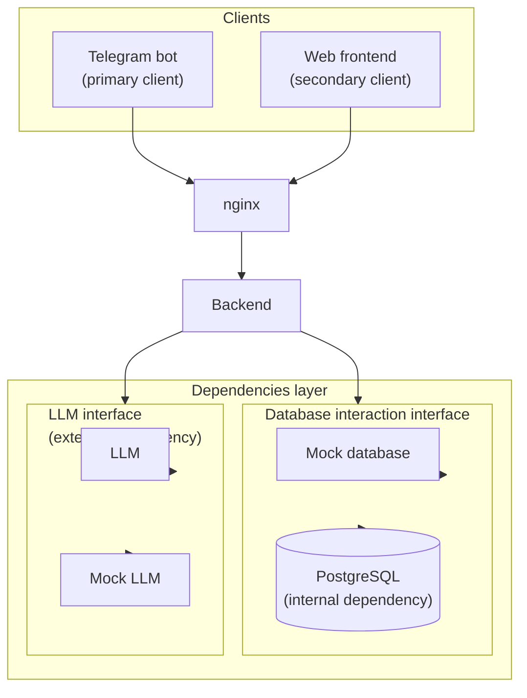
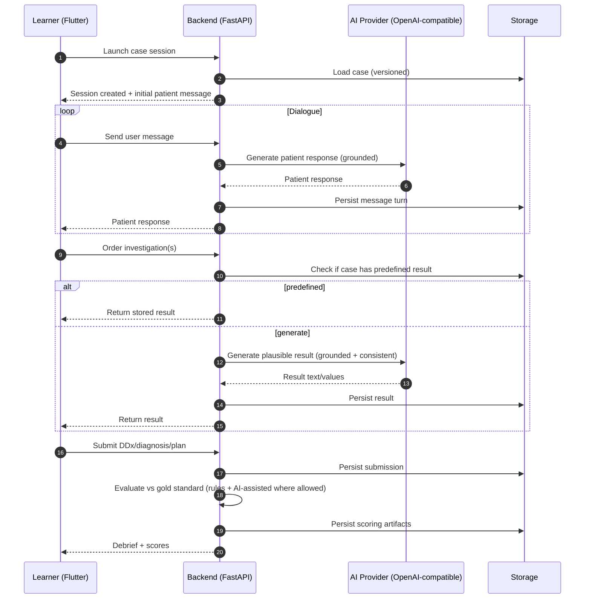

# System Architecture

## Architectural challenges and goals

- **Portability across clients**
  - The Virtual AI Patient must be accessible from multiple clients: web, Telegram bot, and potentially mobile or other channels.
  - The architecture therefore centralizes logic in the backend and exposes channel-agnostic APIs, so new clients can be added without changing the core domain logic.

- **LLM-agnostic AI Patient**
  - The AI Patient is based on an LLM, but the concrete provider can vary.
  - The LLM interface in the dependencies layer abstracts provider-specific details (API shape, auth, rate limits), enabling swapping between different LLMs with minimal impact on the backend.

- **Per-client AI Patients**
  - Different clients (e.g. different clinics, teams, or deployments) should be able to have their *own* Virtual AI Patients (separate configuration, prompts, and possibly models).
  - This requires multi-tenancy support in the backend and persistence layer (e.g. tenant-aware storage for patient configurations, conversations, and audit data).

- **Maintainability and testability**
  - Clear separation between clients, backend, and the dependency layer allows the business logic to be tested independently of infrastructure.
  - Mock implementations for both the database and LLM are first-class parts of the design, so automated tests can run deterministically without relying on external services or real data stores.

## High-level architecture

```mermaid
flowchart TB
    subgraph Clients
        TG["Telegram bot\n(primary client)"]
        WEB["Web frontend\n(secondary client)"]
    end

    TG --> NGINX[nginx]
    WEB --> NGINX
    NGINX --> BE[Backend]

    subgraph Dependencies layer
        subgraph DBLayer[Database interaction interface]
            MOCKDB[Mock database]
            PG[("PostgreSQL\n(internal dependency)")]
        end

        subgraph LLMLayer["LLM interface\n(external dependency)"]
            LLM[LLM]
            MOCKLLM[Mock LLM]
        end
    end

    BE --> DBLayer
    BE --> LLMLayer

    DBLayer --> MOCKDB
    DBLayer --> PG
    LLMLayer --> LLM
    LLMLayer --> MOCKLLM
```

## Dependencies layer

- **Database interaction interface**
  - **Responsibility**: Provides an abstraction for all data-access operations so the backend does not depend on a concrete database implementation.
  - **Production dependency**: **PostgreSQL (internal dependency)** – primary data store for persistent application data.
  - **Testing/development dependency**: **Mock database** – in-memory or lightweight storage used for tests and local runs without a real Postgres instance.

- **LLM interface (external dependency)**
  - **Responsibility**: Wraps all interactions with the external LLM provider behind a stable internal API.
  - **Production dependency**: **LLM** – external large language model service used in the main deployment.
  - **Testing/development dependency**: **Mock LLM** – deterministic or simplified implementation used for tests and offline development.

## Components
- **Flutter Client**
  - Chat UI
  - Investigations ordering UI
  - Submission forms (DDx/diagnosis/plan)
  - Debriefing view

- **FastAPI Backend**
  - Auth / SSO integration
  - Case catalog and access control
  - Session state machine
  - AI orchestration (patient dialogue + investigation generation)
  - Evaluation and scoring
  - Analytics export

- **AI Provider (OpenAI-compatible)**
  - OpenAI-style REST API
  - Token-based authentication
  - Model routing configurable per environment

- **Storage**
  - Case content store (versioned cases)
  - Session store (messages, orders, submissions)
  - Evaluation artifacts (scores, evidence)

## Data flow (typical session)

```mermaid
sequenceDiagram
  autonumber
  participant U as Learner (Flutter)
  participant B as Backend (FastAPI)
  participant A as AI Provider (OpenAI-compatible)
  participant S as Storage

  U->>B: Launch case session
  B->>S: Load case (versioned)
  B-->>U: Session created + initial patient message

  loop Dialogue
    U->>B: Send user message
    B->>A: Generate patient response (grounded)
    A-->>B: Patient response
    B->>S: Persist message turn
    B-->>U: Patient response
  end

  U->>B: Order investigation(s)
  B->>S: Check if case has predefined result
  alt predefined
    B-->>U: Return stored result
  else generate
    B->>A: Generate plausible result (grounded + consistent)
    A-->>B: Result text/values
    B->>S: Persist result
    B-->>U: Return result
  end

  U->>B: Submit DDx/diagnosis/plan
  B->>S: Persist submission
  B->>B: Evaluate vs gold standard (rules + AI-assisted where allowed)
  B->>S: Persist scoring artifacts
  B-->>U: Debrief + scores
```

## LLM Patient Role Design

The believability of the LLM patient role is the product's primary differentiator: comparable clinical-training platforms exist, so quality of execution of the patient behaviours is what the proposal competes on. This section describes how the four core behaviours are realised at the prompt/orchestration level. Full evidence — what was tested, what worked, and what remains preliminary — lives in [Patient role research](../proposal/patient-role-research.md).

- **Lying (concealment vs partial recall)**
  - Two prompt patterns: **deliberate concealment** (an explicit prohibition on naming the diagnosis or using clinical vocabulary, paired with a persona-consistent deflection style) and **partial recall** (the patient reveals a sensitive fact only under repeated direct questioning).
  - Concealment is validated in multi-model runs; partial recall is a design candidate not yet tested. Example pattern and results: [Lying findings](../proposal/patient-role-research.md#lying).

    > Не называй медицинский диагноз и не используй медицинские термины (сердечный приступ, перикардит и т.п.). Если врач предлагает диагноз — отвечай как растерянный пациент, не как специалист.

- **Forgetting**
  - Baseline: a **closed-world instruction with an explicit negative inventory** — the patient answers "не знаю / не помню / не замечал" for anything outside the authorised fact set instead of confabulating. Validated at temperature 0.3; see [Forgetting findings](../proposal/patient-role-research.md#forgetting).
  - Design direction: **turn-count triggered state degradation** — as the interview grows longer, the orchestrator marks selected low-salience facts as "faded" in the per-turn state so the patient plausibly forgets details. Not yet validated (preliminary).

- **Emotions**
  - **Tone modulation grounded in the case persona**: the case defines the emotional state ("тревожный — напуган, но старается чётко отвечать"), and the system prompt binds tone to that persona together with a reply-length constraint so emotion does not become monologue. See [Emotional states findings](../proposal/patient-role-research.md#emotional-states).

- **State management**
  - Per-turn state (facts already disclosed, current disclosure level, emotional state, faded facts) is maintained by the backend session state machine and **fed back into the prompt on every turn**: the system block carries the case facts and behaviour rules, while the full dialogue history is passed in `messages` (no truncation at tested lengths — truncation degraded cross-turn consistency in testing).
  - This is what keeps repeated questions consistent with earlier answers (G4 class in the [failure catalogue](../research/ai-patient-problems-and-mitigations.md)); temperature is held near 0.3 in production since higher values introduced consistency failures.

## Architectural principles
- **LLM Patient Role Design is the primary differentiator** — see [§ LLM Patient Role Design](#llm-patient-role-design); patient-behaviour quality claims must trace to [Patient role research](../proposal/patient-role-research.md).
- **Case-grounded generation**: the AI layer must not invent facts that contradict the case truth.
- **Reproducible scoring**: cases are versioned; scoring references a specific case version.
- **Provider-agnostic AI adapter**: only one integration layer speaks OpenAI-compatible API.
- **Auditable evaluation**: every score deduction has evidence and rationale for debriefing.
- **Security by design**: no real patient data; strict separation of case content vs user data.
